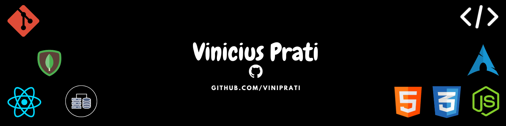



  

  
  <h1 align="center">Ola, sou Vinicius Prati</h1>
  <h3 align="center">Desenvolvedor Full Stack Web</h3>

  Focado em criar solucoes web completas com <strong>React</strong>, <strong>Node.js</strong> e bancos de dados relacionais e nao relacionais.
   
  Transformando ideias em codigo limpo, eficiente e escalavel.

  
  

---

### Sobre Mim

Sou um desenvolvedor **Full Stack Web**, focado em criar aplicacoes completas, do frontend ao backend, com atencao em performance, usabilidade e codigo limpo.

Atualmente, estou cursando **Desenvolvimento de Sistemas para Internet** no **IFES (graduacao)**, fortalecendo minha base tecnica e aplicando esse conhecimento em projetos praticos.

Meu foco e evoluir continuamente na construcao de solucoes web modernas, escalaveis e bem estruturadas.

---

### Tecnologias e Ferramentas

  
  
   
  

- Leve experiencia com Linux: Ubuntu, Kali Linux e Linux Mint.

---

### Meus Proximos Passos

- React e Next.js: aprofundando em SSR e SSG para criar aplicacoes web com alta performance e SEO otimizado.
- APIs e automacoes com Node.js: desenvolvendo APIs RESTful mais eficientes e explorando automacoes de tarefas.
- Arquitetura Full Stack: evoluindo em organizacao de projetos, padroes de codigo e escalabilidade.

---

### Contato

Se voce esta avaliando meu perfil para oportunidades, sera um prazer conversar:

- LinkedIn: [Vinicius-Prati-Machado](https://linkedin.com/in/vinicius-prati-machado-b25206313)
- Email: [viniprati6503@gmail.com](mailto:viniprati6503@gmail.com)

