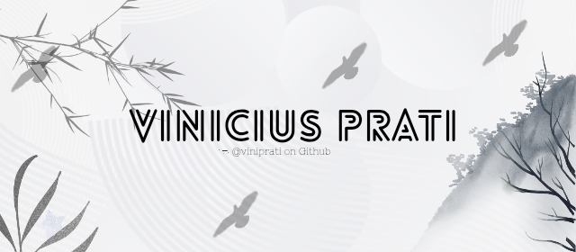

  

  <h1>Olá, eu sou Vinicius Prati</h1>
  <h3>Desenvolvedor Full Stack Web em formação</h3>

  Crio aplicações web com foco em interfaces responsivas, APIs bem estruturadas e soluções completas do frontend ao backend.

  
  
  

  

---

### Sobre mim

Sou desenvolvedor **Full Stack Web**, com foco em construir aplicações completas, organizadas e funcionais. Tenho estudado e praticado principalmente com **React**, **Node.js**, **TypeScript**, bancos de dados relacionais e bancos não relacionais.

Atualmente curso **Desenvolvimento de Sistemas para Internet** no **IFES**, onde venho fortalecendo minha base técnica e aplicando esse conhecimento em projetos práticos.

Também atuo como **Monitor de laboratório de informática** no **IFES Campus Santa Teresa**, com experiência em gestão de laboratórios, manutenção de computadores, instalação de software e apoio ao uso dos ambientes acadêmicos de tecnologia.

Meu objetivo é evoluir como desenvolvedor criando produtos web com boa experiência de uso, código bem estruturado e integração consistente entre frontend, backend e deploy.

---

### Projetos em destaque

| Projeto | Descrição | Tecnologias | Links |
| --- | --- | --- | --- |
| **Aulas Faculdade** | Repositório com exercícios e estudos práticos de Front End, lógica de programação e POO desenvolvidos durante a graduação. | JavaScript, HTML, CSS | [Repositório](https://github.com/viniprati/Aulas-Faculdade) |
| **ST Club** | Landing page estática para divulgação de uma casa de shows fictícia, com foco em apresentação visual e formulário de contato. | HTML, CSS, JavaScript | [Deploy](https://st-club.vercel.app) · [Repositório](https://github.com/viniprati/ST-Club) |
| **FrontLab Academy** | Projeto web com páginas de estudo, trilhas, exercícios e estrutura voltada ao aprendizado de frontend. | JavaScript, Vite | [Deploy](https://frontlabacademy.vercel.app) · [Repositório](https://github.com/viniprati/FrontLab-Academy) |
| **Mini Projeto IFES** | Landing page acadêmica para apresentação de projeto, bots e serviços. | HTML, CSS | [Deploy](https://miniprojetoifes.vercel.app) · [Repositório](https://github.com/viniprati/Mini-Projeto) |

---

### Tecnologias e ferramentas

  
   
  
   
  

**Principais interesses técnicos**

- Desenvolvimento de interfaces com React, TypeScript e Tailwind CSS.
- Construção de APIs REST com Node.js.
- Modelagem e integração com bancos SQL e NoSQL.
- Organização de projetos full stack, versionamento com Git e deploy web.
- Uso do Fedora KDE 44 como sistema operacional principal no dia a dia, além de experiência com outras distribuições Linux.

---

### Atualmente estudando

- **Next.js:** renderização no servidor, geração estática, SEO e performance.
- **Node.js:** APIs REST, automações e estruturação de backends.
- **Arquitetura Full Stack:** padrões de projeto, organização de camadas e escalabilidade.
- **Linux:** uso diário do Fedora e familiaridade com Ubuntu, Kali Linux e Linux Mint.

---

### Atividade no GitHub

<picture>
  <source media="(prefers-color-scheme: dark)" srcset="https://raw.githubusercontent.com/viniprati/viniprati/output/pacman-contribution-graph-dark.svg">
  <source media="(prefers-color-scheme: light)" srcset="https://raw.githubusercontent.com/viniprati/viniprati/output/pacman-contribution-graph.svg">
  
</picture>

---

### Contato

Fique à vontade para entrar em contato para trocar ideias, conversar sobre tecnologia ou conhecer melhor meus projetos.

- LinkedIn: [Vinicius Prati Machado](https://linkedin.com/in/vinicius-prati-machado-b25206313)
- Portfólio: [viniprati.vercel.app](https://viniprati.vercel.app)
- Email: [prativinicius@gmail.com](mailto:prativinicius@gmail.com)
